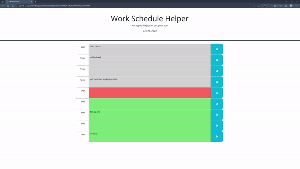

# Work Schedule Helper
### Module 05 challenge

## Application description

Using jquery and [Day.js](https://day.js.org/en/) library, this application schedules different tasks for each hour during a 9-5 business day.  To add a task, simply type into the text box and hit the save button.  Upon saving, the contents of the text area will be saved to local storage and every time the page is reloaded, the text areas will be filled with the saved tasks.

<br>

## User Story

```md
AS AN employee with limited time to work
I WANT to use a planner to help schedule work tasks
SO THAT I can keep track of what needs to be done
```

## Acceptance Criteria

```md

GIVEN I am planning my workday using the helper
WHEN I load the page
THEN the current date and time is displayed
WHEN I scroll down
THEN time blocks representing each hour of the work day are shown
WHEN I view the work day time blocks
THEN previously saved tasks appear in the correct time slots and those
     time slots are colored based on whether the hour has passed yet 
     or if it is the current hour.
WHEN I change the text in a time slot and click the save button
THEN the local data is replaced with the new input and saved locally

```

The following animation demonstrates the application functionality:


